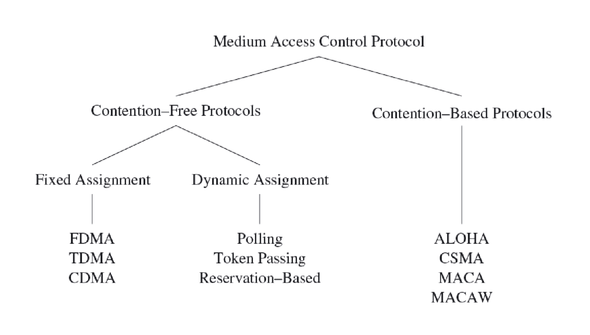
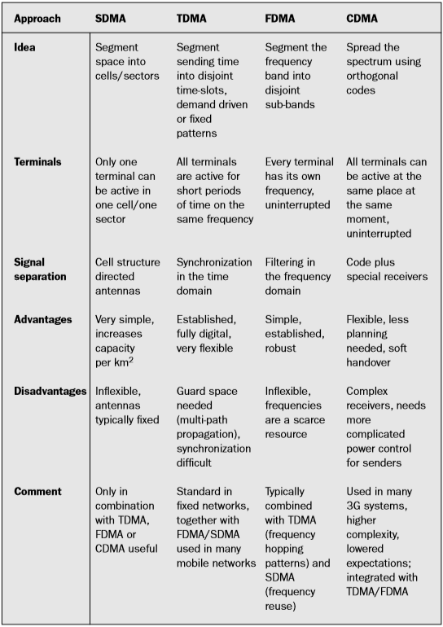

- In most networks, multiple nodes share a communication medium for
  transmitting their data packets!

- The medium access control (MAC) protocol is primarily responsible
  for regulating access to the shared medium!

  -   The choice of MAC protocol has a direct bearing on the
      reliability and efficiency of network transmissions!

  -   due to errors and interferences in wireless communications and
      to other challenges!

  -   Energy efficiency also affects the design of the MAC protocol!

  -   trade energy efficiency for increased latency or a reduction in
      throughput or fairness!

- Responsibilities of MAC layer include:

  -   decide when a node accesses a shared medium

  -   resolve any potential conflicts between competing nodes

  -   correct communication errors occurring at the physical layer

  -   perform other activities such as framing, addressing, and flow
      control.

- Second layer of the OSI reference model (data link layer) or the
  IEEE 802 reference model (which divides data link layer into logical
  link control and medium access control layer.

  {width="3.9583333333333335in"
  height="1.6833333333333333in"}

  {width="4.8in"
  height="2.2666666666666666in"}

- Collisions can be avoided by ensuring that each node can use its
  allocated resources exclusively!

  Examples of fixed assignment strategies:

- FDMA: Frequency Division Multiple Access

1.  the frequency band is divided into several smaller frequency bands

2.  the data transfer between a pair of nodes uses one frequency band

3.  all other nodes use a different frequency band

-   TDMA: Time Division Multiple Access

1.  multiple devices to use the same frequency band

2.  relies on periodic time windows (frames)

3.  frames consist of a fixed number of transmission slots to separate
    the medium accesses of different devices

4.  a time schedule indicates which node may transmit data during a
    certain slot

-   CDMA: Code Division Multiple Access

1.  simultaneous accesses of the wireless medium are supported using
    different codes

2.  if these codes are orthogonal, it is possible for multiple
    communications to share the same frequency band

3.  forward error correction (FEC) at the receiver is used to recover
    from interferences among these simultaneous communications

-   Fixed assignment strategies are inefficient!

1.  it is impossible to reallocate slots belonging to one device to
    other devices if not needed in every frame

2.  generating schedules for an entire network can be a taunting task

3.  these schedules may require modifications every time the network
    topology or traffic characteristics in the network change

-   Dynamic assignment strategies: allow nodes to access the medium on
    demand

1.  polling-based protocols

<!-- -->

1.  a controller device issues small polling frames in a round-robin
    fashion, asking each station if it has data to send

2.  if no data to be sent, the controller polls the next station!

<!-- -->

2.  token passing

<!-- -->

1.  stations pass a polling request to each other (round-robin fashion)
    using a special frame called a token

2.  a station is allowed to transmit data only when it holds the token

<!-- -->

3.  reservation-based protocols

<!-- -->

1.  static time slots used to reserve future access to the medium

    e.g., a node can indicate its desire to transmit data by toggling a
    reservation bit in a fixed location

2.  these often very complex protocols then ensure that other
    potentially conflicting nodes take note of such a reservation to
    avoid collisions

**Contention-Based Medium Access**

-   Nodes may initiate transmissions at the same time

-   requires mechanisms to reduce the number of collisions and to
    recover from collisions!   Example

1.  ALOHA protocol

<!-- -->

1.  uses acknowledgments to confirm the success of a broadcast data
    transmission.

2.  allows nodes to access the medium immediately.

3.  addresses collisions with approaches such as exponential back-off to
    increase the likelihood of successful transmissions.

<!-- -->

2.  slotted-ALOHA protocol

<!-- -->

1.  requires that a station may commence transmission only at predefined
    points in time (the beginning of a time slot).

2.  increases the efficiency of ALOHA.

3.  introduces the need for synchronization among nodes.

<!-- -->

3.  Carrier Sense Multiple Access (CSMA)

<!-- -->

1.  CSMA with Collision Detection (CSMA/CD)

-   sender first senses the medium to determine whether it is idle or
    busy.

-   if it is found busy, the sender refrains from transmitting packets.

-   if the medium is idle, the sender can initiate data transmission.

2.  CSMA with Collision Avoidance (CSMA/CA)

-   CSMA/CD requires that sender aware of collisions.

-   instead, CSMA/CA attempts to avoid collisions in the first place.

**MAC Protocols for WSN**

There are two main categories of MAC protocols for WSNs, according to
how the MAC manages when certain nodes can communicate on the channel:

1.  **Time-division multiple access (TDMA) based:**

    These protocols assign different time slots to nodes. Nodes can send
    messages only in their time slot, thus eliminating contention.
    Examples of these kind of MAC protocols include LMAC, TRAMA, etc.

-   **LMAC**

    LMAC (short for lightweight MAC) is a TDMA-based MAC protocol. There
    are data transfer timeframes, which are divided into time slots. The
    number of time slots in a timeframe is configurable according to the
    number of nodes in the network. Each node has its own time slot, in
    which only that particular node can transmit. This saves power, as
    there are no collisions or retransmissions. A transmission consist
    of a control message and a data unit. The control message contains
    the destination of the data, the length of the data unit, and
    information about which time slots are occupied. All nodes wake up
    at the beginning of each time slot. If there is no transmission, the
    time slot is assumed to be empty (not owned by any nodes), and the
    nodes go back to sleep. If there is a transmission, after receiving
    the control message, nodes that are not the recipient go back to
    sleep. The recipient node and the sender node goes back to sleep
    after receiving/sending the transmission. Only one message can be
    sent in each time slot. In the first five timeframes, the network is
    set up and no data packets are sent. The network is set up by nodes
    claiming a time slot. They send a control message in the time slot
    they want to reserve. If there are no collisions, nodes note that
    the time slot is claimed. If there are multiple nodes trying to
    claim the same time slot, and there is a collision, they randomly
    choose another unclaimed time slot.

-   **TRAMA**

    Traffic adaptive medium access (TRAMA) protocol which aims to
    achieve the energy efficiency by avoiding the collisions of data
    packets while receiving and by employing a low power mode for node
    which are not scheduled in transmission and reception. The usage of
    low power mode is dynamically determined and adapted according to
    traffic pattern. TRAMA applies a traffic adaptive distribution
    election scheme that selects the receivers based on the schedules
    announced by transmitters. Nodes using TRAMA, exchange their two hop
    information and the transmission schedules fixing which nodes are
    the intended receivers of their traffic in chronological order.
    TRAMA consists of three components which are neighbour protocol(NP),
    schedule exchange protocol (SEP) which allows to exchange two-hop
    neighbour information and schedules and adaptive election algorithm
    (AEA) uses the information of NP,SEP and it selects transmitters and
    receivers for current time slot and leaving the other nodes in
    network to switch to the low power mode.

2.  **Carrier-sense multiple access (CSMA) based:**

    These protocols use carrier sensing and backoffs to avoid
    collisions, similarly to IEEE 802.11. Examples include B-MAC, SMAC,
    TMAC, X-MAC.

-   **B-MAC**

    B-MAC (short for Berkeley MAC) is a widely used WSN MAC protocol, it
    is part of TinyOS. It employs low-power listening (LPL) to minimize
    power consumption due to idle listening. Nodes have a sleep period,
    after which they wake up and sense the medium for preambles (clear
    channel assessment - CCA.) If none is detected, the nodes go back to
    sleep. If there is a preamle, the nodes stay awake and receive the
    data packet after the preamle. If a node wants to send a message, it
    first sends a preamle for at least the sleep period in order for all
    nodes to detect it. After the preable, it sends the data packet.
    There are optional acknowledgements as well. After the data packet
    (or data packet + ACK) exchange, the nodes go back to sleep. Note
    that the preamble doesn't contain addressing information. Since the
    recipient's address is contained in the data packet, all nodes
    receive the preamble and the data packet in the sender's
    communication range (not just the intended recipient of the data
    packet.)

-   **X-MAC**

    X-MAC is a development on B-MAC and aims to improve on some of
    B-MAC's shortcomings. In B-MAC, the entire preamle is transmitted,
    regardless of whether the destination node awoke at the beginning of
    the preamle or at the end. Furthermore, with B-MAC, all nodes
    receive both the preamble and the data packet. X-MAC employs a
    strobed preamble, i.e. sending the same lenght preamle as B-MAC, but
    as shorter bursts, with pauses in between. The pauses are long
    enough that the destination node can send an acknowledgement if it
    is already awake. When the sender receives the acknowledgement, it
    stops sending preambles and sends the data packet. This can save
    time because potentially, the sender doesn't have to send the whole
    length preamble. Also, the preamle contains the address of the
    destination node. Nodes can wake up, receive the preamble, and go
    back to sleep if the packet is not addressed to them. These features
    improve B-MAC's power efficiency by decreasing nodes' time spent in
    idle listening.

> {width="4.433333333333334in"
> height="5.875in"}
>
> **Routing Protocols**
>
> Routing protocols for wireless sensor networks can be classified as
> data-centric, hierarchical or location-based. In these three
> categories, source, shortest path, and hierarchical-geographical
> strategies play an important role to develop all of the routing
> protocols

**Data-centric protocols**

In data-centric protocols, the sensor nodes broadcast an advertisement
for the available data and wait for a request from an interested sink.
Flooding is a simple technique that can be used to broadcast information
in wireless sensor networks, however it requires significant resources
because each node receiving a message must rebroadcast it, unless a
maximum number of hops for the packet are reached, or the destination of
the packet is the node itself. Flooding is a reactive technique that
does not require costly topology maintenance or complex route discovery
algorithms. However, it does have several additional deficiencies such
as: implosion, overlap and resource blindness \[8\]. A derivation of
flooding is gossiping, in which nodes do not broadcast. Instead, they
send the incoming packets to a randomly selected neighbour. Sensor
protocols for information via negotiation (SPIN) address the
deficiencies of classic flooding by providing negotiation and resource
adaptation \[9\]. However, SPIN data advertisement mechanism cannot, by
itself, guarantee data delivery \[10\]. SPIN employs a shortest path
strategy based on three types of messages to communicate:

ADV- new data advertisement. When a SPIN node has data to share, it can
advertise this fact by transmitting an ADV message containing meta-data.
REQ - request for data. A SPIN node sends an REQ message when it wishes
to receive some actual data. DATA - data message. DATA messages contain
actual sensor data with a meta-data header.

Unlike traditional networks, a sensor node does not necessarily require
an identity (e.g. an address). Instead, applications focus on the
different data generated by the sensors. Because data is identified by
its attributes, applications request data by matching certain attribute
values. One of the most popular algorithms for data-centric protocols is
direct diffusion and it bases its routing strategy on shortest path. A
sensor network based on direct diffusion exhibits the following
properties: each sensor node names data that it generates with one or
more attributes, other nodes may express interests based on these
attributes, and network nodes propagate interests. Interests establish
gradients that direct the diffusion of data. In its simple form, a
gradient is a scalar quantity. Negative gradients inhibit the
distribution of data along a particular path, and positive gradients
encourage the transmission of data along the path. The Energy-Aware
Routing protocol is a destination-initiated reactive protocol that
increases the network lifetime using only one path at all times, it
seems very similar to source routing. Rumor routing is a variation of
direct diffusion that is mainly intended for applications where
geographic routing is not feasible. Gradient based routing is another
variant of direct diffusion \[14\]. The key idea of gradient based
routing is to memorize the number of hops when the interest is diffused
throughout the network. Constraint Anisotropic Diffusion Routing (CADR)
is a general form of direct diffusion \[15\] and lastly, Active Query
Forwarding in Sensor Networks (ACQUIRE) \[16\] views the network as a
distributed database, where complex queries can be further divided into
several sub queries.

**Hierarchical protocols**

Hierarchical protocols are based on clusters because clusters can
contribute to more scalable behaviour as the number of nodes increases,
provide improved robustness, and facilitate more efficient resource
utilization for many distributed sensor coordination tasks. Low-Energy
Adaptive Clustering Hierarchy (LEACH) is a cluster-based protocol that
minimizes energy dissipation in sensor networks by randomly selecting
sensor nodes as cluster-heads \[17\]. Power-Efficient Gathering in
Sensor Information System (PEGASIS) \[18\] is a near optimal chain-based
protocol. The basic idea of the protocol is to extend network lifetime
by allowing nodes to communicate exclusively with their closest
neighbours, employing a turn-taking strategy to communicate with the
Base Station (BS). Threshold-sensitive Energy Efficient protocol (TEEN)
\[19\] and Adaptive Periodic TEEN (APTEEN) \[20\] have also been
proposed for time-critical applications. In TEEN, sensor nodes
continuously sense the medium, but data transmission is done less
frequently. APTEEN, on the other hand, is a hybrid protocol that changes
the periodicity or threshold values used in the TEEN protocol, according
to user needs and the application type.

**Location-based protocols**

In location-based routing, the forwarding decision by a node is
primarily based on the position of a packet\'s destination and the
position of the node\'s immediate onehop neighbour. The position of the
destination is contained in the header of the packet. If a node has a
more accurate position of the destination, it may choose to update the
position in the packet before forwarding it. The position of the
neighbours is typically learned through a one-hop broadcast beacon.
These beacons are sent periodically by all nodes and contain the
position of the sending node. We can distinguish three main
packet-forwarding strategies for position-based routing: greedy
forwarding, restricted directional flooding, and hierarchical
approaches. For the first two, a node forwards a given packet to one
(greedy forwarding) or more (restricted directional flooding) one-hop
neighbours that are located closer to the destination than the
forwarding node itself. The selection of the neighbour in the greedy
case depends on the optimization criteria of the algorithm. The third
forwarding strategy is to form a hierarchy in order to scale to a large
number of mobile nodes. Minimum Energy Communication Network (MECN)
\[21\] establishes and maintains a minimum energy network for wireless
networks by utilizing low-power geographic positioning system (GPS). The
main idea of MECN is to find the sub-network with the smallest number of
nodes that requires the least transmission power between any two
particular nodes (shortest path). The Small Minimum Energy Communication
Network (SMECN) \[22\] is an extension of MECN. The major drawback with
MECN is that it assumes every node can transmit to every other node,
which is not always possible. One advantage of SMECN is that it
considers obstacles between pairs of nodes. Geographic Adaptive Fidelity
(GAF) \[23\] is an energy-aware location-based

Routing Strategies for Wireless Sensor Networks 195

routing algorithm primarily designed for ad-hoc networks that can also
be applied to sensor networks. GAF conserves energy by turning off
unnecessary nodes in the network without affecting the level of routing
fidelity. Finally, Geographic and Energy Aware Routing \[24\] uses
energy-awareness and geographically informed neighbour selection
heuristics to route a packet toward the destination region.

**ZigBee Protocol**

The IEEE 802.15.4-2003 standard defines the lower two layers: the
physical (PHY) layer and the medium access control (MAC) sub-layer. The
ZigBee alliance builds on this foundation by providing the network (NWK)
layer and the framework for the application layer, which includes the
application support sub-layer (APS), the ZigBee device objects (ZDO) and
the manufacturer-defined application objects. IEEE 802.15.4-2003 has two
PHY layers that operate in two separate frequency ranges: 868/915 MHz
and 2.4 GHz. The 2.4 GHz mode specifies a Spread Spectrum modulation
technique with processing gain equal to 32. It handles a data rate of
250 kbps, with Offset-QPSK modulation, and a chip rate of 2 Mcps. The
868/915 MHz mode specifies a DSSS modulation technique with data rates
of 20/40 kbps and chip rates of 300/600 kcps. The digital modulation is
BPSK and the processing gain is equal to 15. On the other hand, the MAC
sub-layer controls access to the radio channel using a CSMA-CA
mechanism. Its responsibilities may also include transmitting beacon
frames, synchronizing transmissions and providing a reliable
transmission mechanism. The responsibilities of the ZigBee NWK layer
includes mechanisms used to join and exit a network, in order to apply
security to frames and to route frames to their intended destinations
based on shortest path strategy. In addition, the discovery and
maintenance of routes between devices transfer to the NWK layer. Also,
the discovery of one-hop neighbors and the storing of pertinent neighbor
information are done at the NWK layer. The NWK layer of a ZigBee
coordinator is responsible for starting a new network, when appropriate,
and assigning addresses to newly associated devices. The
responsibilities of the APS sub-layer include maintaining tables for
binding, which is the ability to match two devices together based by
their services and their needs, and forwarding messages between bound
devices. The responsibilities of the ZDO include defining the role of
the device within the network, initiating and/or responding to binding
requests and establishing a secure relationship between network devices.
The ZDO is also responsible for discovering devices on the network and
determining which application services they provide.

-   **Data Dissemation**

    A data dissemination is a process by which data and queries for data
    are routed in the sensor network. In a scope of data dissemination,
    a source is the node that generates the data and an event is the
    information to be reported . A node that is interested in data is
    called sink and the interest is a descriptor for some event that
    node is interested in. Thus, after source receives an interest from
    the sink, the event is transferred from the source to the sink. As a
    result, data dissemination is a two-step process. First, the node
    that is interested in some events, like temperature or air humidity,
    broadcasts its interests to its neighbours periodically. Interests
    are then propagated through the whole sensor network. In the second
    step, nodes that have requested data, send back data after receiving
    the request. Intermediate nodes in the sensor network also keep a
    cache of received interests and data. There exist several different
    data dissemination methods. In this paper flooding, gossiping, SPIN
    \[2\], and cost-field approach \[3\] are covered in

1.  **Flooding**

    In flooding method each sensor node that receives a packet
    broadcasts it to its neighbours assuming that node itself is not the
    destination of the packet and the maximum hop count is not reached.
    This ensures that the data and queries for data are sent all over
    the network. Flooding is a very simple method, but is has several
    disadvantages. In flooding duplicate messages can be sent to the
    same node which is called implosion. This occurs when a node
    receives the same message for several neighbours. In addition, the
    same event may be sensed by several nodes, and thus when using
    flooding, neighbours will receive duplicate reports of the same
    event, this situation is called overlap. Finally, many redundant
    transmissions occur when using flooding and flooding does not take
    into account available energy at sensor nodes. This wastes a lot of
    network\'s resources and decreases the lifetime of the network
    significantly.

2.  **Gossiping**

    Gossiping method is based on flooding, but node that receives the
    packet forwards it only to a single randomly selected neighbour
    instead of sending it to all neighbours. The advantage of gossiping
    is that it avoids the problem of implosion and it does not waste as
    much network resources as flooding. The biggest disadvantage of
    gossiping is that since the neighbour is selected randomly, some
    nodes in the large network may not receive the message at all. Thus,
    gossiping is not a reliable method for data dissemination.

3.  **SPIN**

    Sensor Protocols for Information via Negotiation (SPIN) use
    negotiation and resource adaption to address the disadvantages of
    basic flooding. SPIN uses data-centric routing, nodes are
    advertising their data and they will send the data after receiving a
    reply from interested nodes. SPIN uses three types of messages: ADV,
    REQ, and DATA. The sensor node that has collected some data sends an
    ADV message containing meta-data describing the actual data. If some
    of node\'s neighbors is interested in the data, the neighbor sends a
    REQ message back. After receiving the REQ message, the sensor node
    sends the actual DATA. The neighbor also sends ADV message forward
    to its neighbors, thus data is disseminated through the network

4.  **Cost-field approach**

    The aim of the cost-field approach is to solve problem of setting
    paths to the sink. The cost-field approach is a two-phase process,
    first the cost field is set up in all sensor nodes, based on some
    metric like a delay. In the second phase, data is disseminated using
    the costs. The cost at each node is the minimum cost from the node
    to the sink, which occurs on the optimal path. With the cost-field
    approach explicit path information does not need to be maintained.

-   **Data Gathering**

    The aim of data gathering is to transmit data that has been
    collected by the sensor nodes to the base station. Data gathering
    algorithms aim to maximize the amount of rounds of communication
    between nodes and the base station, one round means that the base
    station has collected data from all sensor nodes. Thus, data
    gathering algorithms try to minimize power consumption and delay of
    the gathering process. Data gathering may seem similar to data
    dissemination, but there are some differences. In data
    dissemination, also other nodes beside the base station can request
    the data while in data gathering all data is transmitted to the base
    station. In addition, in data gathering data can be transmitted
    periodically, while in data dissemination data is always transmitted
    on demand. Various data gathering approaches like direct
    transmission, PEGASIS \[4\], and binary scheme \[5\] will be covered
    here in more detail.

1.  Direct transmission In direct transmission method all sensor nodes
    send their data directly to the base station. While direct
    transmission is a simple method, it is also very ineffective. Some
    sensor nodes may be very far away from the base station, thus amount
    of energy consumed can be extremely high. In addition, sensor nodes
    must take turns when transmitting data to the base station to avoid
    collision. Thus, the delay is also very high. Overall, direct
    transmission method performs very poorly since the aim of data
    gathering approaches is to minimize both the energy consumption and
    the delay.

2.  PEGASIS Power-Efficient Gathering for Sensor Information Systems
    (PEGASIS) is a data gathering protocol that assumes that all sensor
    nodes know the topology of the whole network. PEGASIS aims to
    minimize the transmission distances over the whole sensor network,
    minimize the broadcast overhead, minimize the amount of messages
    that are sent to the base station, and to distribute the energy
    consumption equally between all nodes.

3.  Binary scheme is also a chain-based scheme like PEGASIS. It
    classifies nodes into different levels. All nodes that receive
    message at one level rise to the next level where the amount of
    nodes is halved. Transmission on a one level occur simultaneously to
    reduce delay. An example of the binary scheme is shown in Figure 4
    below. Nodes s1, s3, s5 and s7 receive messages on the first level
    and thus they rise to the next level. On the second level nodes s3
    and s7 receive messages and finally node s7 forwards all data to the
    base station.

    **ROUTING CHALLENGES & DESIGN ISSUES IN WSN**

-   High energy efficiency, in order to increase the node autonomy.

-   Low cost, as a network that covers a large area can consist of
    hundreds or thousands of nodes. An estimation of the number of the
    nodes that are required to cover a given area is presented in.

-   Distributed Sensing, in order to cover a large area despite the
    obstacles in the environment.

-   Wireless communication, as it is the only choice for nodes deployed
    in remote areas or where no cabling infrastructure is available.

-   Multi-hop networking. Depending on the radio parameters, it can be
    more efficient to reach a distant node or a base station using two
    or more wireless hops than a single large distance hop.

-   Local data processing in the node, like zero suppression, data
    compression and parameter extraction can reduce the transmitted
    payload, and, thus, the power consumption.

The design of routing protocols in WSNs is influenced by many
challenging factors. These factors must be overcome before efficient
communication can be achieved. Following some of the routing challenges
and design issues that affect routing process in WSNs, are summarized.

1)  **Node Deployment**

    Node deployment in WSNs is application dependent and affects the
    performance of the routing protocol. The deployment can be either
    deterministic or randomized. In deterministic deployment, the
    sensors are manually placed and data is routed through predetermined
    paths. However, in random node deployment, the sensor nodes are
    scattered randomly creating an infrastructure in an ad hoc manner.
    If the resultant distribution of nodes is not uniform, optimal
    clustering becomes necessary to allow connectivity and enable energy
    efficient network operation. Inter-sensor communication is normally
    within short transmission ranges due to energy and bandwidth
    limitations. Therefore, it is most likely that a route will consist
    of multiple wireless hops.

2)  **Energy Consumption without Losing Accuracy**

    The sensor nodes can use up their limited supply of energy
    performing computations and transmitting information in a wireless
    environment. As such, energy conserving forms of communication and
    computation are essential. Sensor node lifetime shows a strong
    dependence on the battery lifetime. In a multihop WSN, each node
    plays a dual role as data sender and data router. The malfunctioning
    of some sensor nodes due to power failure can cause significant
    topological changes and might require rerouting of packets and
    reorganization of the network.

3)  **Data Reporting**

    Model Data sensing and reporting in WSNs is dependent on the
    application and the time criticality of the data reporting. Data
    reporting can be categorized as either time- driven (continuous),
    event-driven, querydriven, and hybrid. The time-driven delivery
    model is suitable for applications that require periodic data
    monitoring. As such, sensor nodes will periodically switch on their
    sensors and transmitters, sense the environment and transmit the
    data of interest at constant periodic time intervals.

4)  **Fault-Tolerance**

    Some sensor nodes may fail or be blocked due to lack of power,
    physical damage, or environmental interference. The failure of
    sensor nodes should not affect the overall task of the sensor
    network. If many nodes fail, MAC and routing protocols must
    accommodate formation of new links and routes to the data collection
    base stations\[5\]. This may require actively adjusting transmit
    powers and signaling rates on the existing links to reduce energy
    consumption, or rerouting packets through regions of the network
    where more energy is available. Therefore, multiple levels of
    redundancy may be needed in a fault tolerant sensor network.

5)  **Scalability**

    The number of sensor nodes deployed in the sensing area may be in
    the order of hundreds or thousands, or more. Any routing scheme must
    be able to work with this huge number of sensor nodes. In addition,
    sensor net-work routing protocols should be scalable enough to
    respond to events in the environment. Until an event occurs, most of
    the sensors can remain in the sleep state, with data from the few
    remaining sensors providing a coarse quality.

6)  **Network Dynamics**

    Most of the network architectures assume that sensor nodes are
    stationary. However, mobility of both BSs and sensor nodes is
    sometimes necessary in many applications \[8\]. Routing messages
    from or to moving nodes is more challenging since route stability
    becomes an important issue, in addition to energy, bandwidth etc.
    
    **Basic Stratergies**
    
    In source routing, each packet header carries the complete ordered
    list of nodes through which the packet must pass. The key advantage
    of source routing is that intermediate nodes do not need to maintain
    up-to-date routing information in order to route the packets they
    forward, since the packets themselves already contain all the
    routing information. This fact, coupled with the on-demand nature of
    the protocol, eliminates the need for the periodic route
    advertisement and neighbour detection packets present in other
    protocols such as the Energy Aware Routing. In the shortest path
    strategy, when a node S needs a route to destination D, it
    broadcasts a route request message to its neighbours, including the
    last known sequence number for that destination. The route request
    is flooded in a controlled manner through the network until it
    reaches a node that has a route to the destination.
    
    Each node that forwards the route request creates a reverse route
    for itself back to node S. Examples are SPIN, Direct Diffusion,
    MECN, and the ZigBee standard. When the route request reaches a node
    with a route to D, that node generates a route reply containing the
    number of hops necessary to reach D and the sequence number for D
    most recently seen by the node generating the reply. Importantly,
    each node that forwards this reply back toward the originator of the
    route request (node S) creates a forward route to D. The state
    created in each node remembers only the next hop and not the entire
    route, as would be done in source routing. Hierarchical-geographical
    strategy improves the traditional routing strategies based on
    non-positional routing by making use of location information
    provided by GPS as it minimizes flooding of its Location Request
    (LREQ) packets. Flooding, therefore, is directive for traffic
    control by using only the selected nodes, called gateway nodes to
    diffuse LREQ messages. The purpose of gateway nodes is to minimize
    the flooding of broadcast messages in the network by reducing
    duplicate retransmissions in the same region. Member nodes are
    converted into gateways when they receive messages from more than
    one cluster-head. All the members of the cluster read and process
    the packet, but do not retransmit the broadcast message. This
    technique significantly reduces the number of retransmissions in a
    flooding or broadcast procedure in dense networks. Therefore, only
    the gateway nodes retransmit packets between clusters (hierarchical
    organization). Moreover, gateways only retransmit a packet from one
    gateway to another in order to minimize unnecessary retransmissions,
    and only if the gateway belongs to a different cluster-head. We
    decided to evaluate source, shortest path and
    hierarchical-geographical routing strategies since they represent
    the foundation of all of the above mentioned routing protocols. The
    simulator for evaluating the three routing strategies for our
    wireless sensor network is implemented in OPNET 11.5, and the
    simulation models a network of 225 MICAz sensor nodes \[2\]. This
    configuration represents a typical scenario where nodes are
    uniformly placed within an area of 1.5 km2. We used a 2405- 2480 MHz
    frequency range and a 250 kbps data rate for our simulation, with a
    MICAz sensor node separation of 75 m. This scenario represents a
    typical wireless sensor network with one sink node acting as a
    gateway to communicate the WSN with a separate network (Internet).
    In our scenario one sensor node communicates with the sink, and the
    sensor node sends a packet every second (constant bit rate).
    
    **Transport control protocol**
    
    The architecture of computer and communication networks is often
    structured in layers: physical, data link, network (or
    internetworking), transport, and other higher layers, including
    session, presentation, and application. Each lower layer acts as a
    service provider to its immediate upper layer, which is a service
    user. Interactions between neighbouring layers occur through service
    access points (SAPs). For example, the data link layer provides link
    services to the network layer, which is immediately above the link
    layer. The network layer provides addressing and routing services to
    the transport layer above it, which in turn provides message
    transportation service to the layers above it. In this model, the
    lower three layers exist almost exclusively in all nodes. But the
    transport and layers above it exist only at the endpoints or hosts,
    and perform as part of end-to-end protocol functions.
    
    The transport layer provides end-to-end segment transportation,
    where messages are segmented into a chain of segments at the source
    and are reassembled back into the original message at the
    destination nodes. The transport layer does not concern itself with
    the underlying protocol structures for delivery and/or with the
    mechanisms used to deliver the segments to the destination nodes.
    Examples of transport protocols are the transport control protocol
    (TCP) \[7.7\], the user datagram protocol (UDP) \[7.8\], the
    sequenced packet exchange protocol (SPX), and NWLink (Microsoft's
    approach to implementing IPX/SPX). TCP and UDP are commonly deployed
    
    in the Internet.
    
    TCP can be classified as either connection-oriented and
    connectionless. The connection-oriented protocol operation consists
    of the following three phases:

<!-- -->

1.  **Connection establishment.** The sender issues a request message to
    establish a connection between itself and the destination. If the
    destination node is available and there is a path between source and
    the destination, a connection will be established. This connection
    is a logical link connecting the sender and the receiver.

2.  **Data transmission.** After a connection has been established, data
    transmission commences between the sender and the receiver. During
    the information exchange, the rate at which either side is
    transmitting may be adjusted. This adjustment depends on the
    possible congestion (or lack thereof) in the network. Since data may
    be lost in the process of transmission, the transport protocol may
    support packet loss detection and loss recovery mechanisms.

3.  **Disconnect**. After completion of data exchange between the source
    and the destination, the connection is torn down. In some cases,
    unexpected events such as the receiver becoming unavailable in the
    midst of data exchange may also lead to connection breakdown.

**Problems with Transport Control Protocols**

The major functions of transport protocols for wireless sensors networks
that should be considered carefully in the design of these protocols are
congestion control reliability guarantee, and energy conservation. Most
of the existing protocols reviewed here and reflected in the literature
provide either congestion or reliability in either upstream or
downstream (not both). Certain applications in wireless sensor networks
require it in both directions: for example, re-tasking and critical time
sensitive monitoring and surveillance operations. Another problem with
the existing transport protocols for wireless sensor networks is that
they only control congestion either end-to-end or hop-by-hop. Although
in CODA there are both end-to-end and hop-by-hop mechanisms for
congestion control, it uses them simultaneously rather than adaptively.
An adaptive congestion control that integrates end-to-end and hop-by-hop
mechanis ms may be more helpful for wireless sensor networks with
diverse applications, and useful due to energy conservation and
simplification of sensor node operation.

Transport protocols studied so far provide either packet- or
application-level reliability (if reliability is provided at all). If a
sensor network supports two applications, one that requires packet-level
reliability and the other application-level reliability, the existing
transport control protocols will face difficulty. Therefore, an adaptive
recovery mechanism is required to support packet- and applicationlevel
reliability as well as for energy efficiency. None of the existing
transport protocols implement cross-layer optimization. As discussed
earlier, lower layers, such as the network and MAC layers, can provide
useful information to the transport layer.

**EXAMPLES OF EXISTING TRANSPORT CONTROL PROTOCOLS**

Examples of several transport protocols designed for WSNs are shown in
Table 7.1. Most examples can be grouped in one of the four groups:
upstream congestion control, downstream congestion control, upstream
reliability guarantee, and downstream reliability guarantee.

**CODA (Congestion Detection and Avoidance)**

CODA \[7.1\] is an upstream congestion control technique that consists
of three elements: congestion detection, open-loop hop-by-hop
backpressure, and closed-loop end-to-end multisource regulation. CODA
attempts to detect congestion by monitoring current buffer occupancy and
wireless channel load. If buffer occupancy or wireless channel load
exceeds a threshold, it implies that congestion has occurred. The node
that has detected congestion will then notify its upstream neighbor to
reduce its rate, using an open-loop hop-by-hop backpressure. The
upstream neighbor nodes trigger reduction of their output rate using
methods such as AIMD. Finally, CODA regulates a multisource rate through
a closed-loop end-to-end approach, as follows: (1) When a sensor node
exceeds its theoretical rate, it sets a ''regulation'' bit in the
''event'' packet; (2) If the event packet received by the sink has a
''regulation'' bit set, the sink sends an ACK message to the sensor
nodes and informs them to reduce their rate; and (3) if the congestion
is cleared, the sink will send an immediate ACK control message to the
sensor nodes, informing them that they can increase their rate. CODA's
disadvantages are its unidirectional control, only from the sensors to
the sink; there is no reliability consideration; and the response time
of its closed-loop multisource control increases under heavy congestion
since the ACK issued from the sink will probably be lost.

**ESRT (Event-to-Sink Reliable Transport)**

ESRT \[7.2\], which provides reliability and congestion control, belongs
to the upstream reliability guarantee group. It periodically computes a
reliability figure ðrÞ, representing the rate of packets received
successfully in a given time interval. ESRT then deduces the required
sensor reporting frequency (f) from the reliability figure (r) using an
expression such as f ¼ GðrÞ. Finally, ESRT informs all sensors of the
values of ( f) through an assumed channel with high power. ESRT uses an
end-to-end approach to guarantee a desired reliability figure through
adjusting the sensors' reporting frequency. It provides overall
reliability for the application. The additional benefit of ESRT is
energy conservation through control of reporting frequency.
Disadvantages of ESRT are that it advertises the same reporting
frequency to all sensors (since different nodes may have contributed
differently to congestion, applying different frequencies would be more
appropriate) and considers mainly reliability and energy conservation as
performance measures.

**RMST (Reliable Multisegment Transport)**

RMST \[7.3\] guarantees successful transmission of packets in the
upstream direction. Intermediate nodes cache each packet to enable
hop-by-hop recovery, or they operate in noncache mode, where only end
hosts cache the transmitted packets for end-to-end recovery. RMST
supports both cache and noncache modes. Furthermore, RMST uses selective
NACK and timer-driven mechanisms for loss detection and notification. In
the cache mode, lost packets are recovered hop by hop through the
intermediate sensor nodes. If an intermediate node fails to locate the
lost packet, or if the intermediate node works in noncache mode, it will
forward the NACK upstream toward the source node. RMTS is designed to
run above directed diffusion \[7.12\], which is a routing protocol, in
order to provide guaranteed reliability for applications. Problems with
RMST are lack of congestion control, energy efficiency, and
application-level reliability.

**PSFQ (Pump Slowly, Fetch Quickly)**

PSFQ \[7.4\] distributes data from sink to sensors by pacing data at a
relatively slow speed but allowing sensor nodes that experience data
loss to recover any missing segments from immediate neighbors. This
approach belongs to the group downstream reliability guarantee. The
motivation is to achieve loose delay bounds while minimizing loss
recovery by localizing data recovery among immediate neighbors. PSFQ
consists of three operations: pump, fetch, and report. This is how PSFQ
works: Sink broadcasts a packet to its neighbors every T time units
until all the data fragments have been sent out. Once a sequence number
gap is detected, the sensor node goes into fetch mode and issues a NACK
in the reverse path to recover the missing fragment. The NACK is not
relayed by the neighbor nodes unless the number of times that the NACK
is sent exceeds a predefined threshold \[7.4\]. Finally, the sink can
ask sensors to provide it with the data delivery status information
through a simple and scalable hop-by-hop report mechanism. PSFQ has the
following disadvantages: It cannot detect packet loss for single packet
transmission; it uses a slow pump, which results in a large delay; and
hop-by-hop recovery with cache necessitates larger buffer sizes.

**GARUDA**

GARUDA \[7.5\] is in the downstream reliability group. It is based on a
two-tier node architecture; nodes with 3i hops from the sink are
selected as core sensor nodes (I is an integer). The remaining nodes
(noncore) are called second-tier nodes. Each noncore sensor node chooses
a nearby core node as its core node. Noncore nodes use core nodes for
lost packet recovery. GARUDA uses a NACK message for loss detection and
notification. Loss recovery is performed in two categories: loss
recovery among core sensor nodes \[7.5\], and loss recovery between
noncore sensor nodes and their core node. Therefore, retransmission to
recover lost packets looks like a hybrid scheme between pure hop by hop
and end to end. GARUDA designs a repeated wait for first packet (WFP)
pulse transmission to guarantee the success of single or first packet
delivery. Furthermore, pulse transmission is used to compute the hop
number and to select core sensor nodes in order to establish a two-tier
node architecture. Disadvantages of GARUDA include lack of reliability
in the upstream direction and lack of congestion control. Published
results on GARUDA at the time of this writing did not include reports of
any results on reliability or a performance comparison with other
algorithms, such as PSFQ.

**ATP (Ad Hoc Transport Protocol)**

ATP \[7.6\] works based on a receiver-and network-assisted end-to-end
feedback control algorithm. It uses selective ACKs (SACKs) for packet
loss recovery. In ATP, intermediate network nodes compute the sum of
exponentially distributed packet queuing and transmission delay, called
D. The required end-to-end rate is set as the inverse of D. The values
of D are computed over all packets that traverse a given sensor node,
and if it exceeds the value that is piggybacked in each outgoing packet,
it updates the field before forwarding the packet. The receiver
calculates the required end-to-end rate (inverse of D) and feeds it back
to the sender. Thus, the sender can intelligently adjust its sending
rate according to the value received from the receiver. To guarantee
reliability, ATP uses selective ACKs (SACKs) as an end-to-end mechanism
for loss detection. ATP decouples congestion control from reliability
and as a result, achieves better fairness and higher throughput than
TCP. However, energy issues are not considered for this design, which
raises the question of optimality of ATP for an end-to-end control
scheme.

Performance of TCP

To estimate the performance of a system there are certain metrics 
associated with the system under consideration and a range of desired values 
for those metrics. These values of the metrics determine the quality of the 
system and its suitability for the proposed objective. In similar lines, the 
standard metrics considered in this work to evaluate the performance of WSN 
employed with different protocols are Throughput, Energy Consumption, 
Routing Load, MAC Load, Dropped Packets and End-to-End Delay. 

1. **Throughput**
   This metric defines the number of packets received by a destination 
   or sink over the given period of time. Obviously, a better congestion control 
   algorithm results in the delivery of good number of packets with respect to 
   time always. The unit for throughput is kilo bits per sec (Kbps).  
2. **Energy Consumption** 
   The average energy consumed by all the nodes of the network is 
   considered as a metric to assess the performance of the congestion control 
   algorithms. The energy consumption of a node depends on several parameters such as sensor data reporting interval, routing protocol, transport protocol, 
   congestion control algorithm of the transport protocol etc., and it is obvious 
   that the lower energy consumption signifies better congestion control 
   algorithm. The unit for this metric is Joules. 
3. **Routing Load** 
   It is the number of routing packets required to transmit a data 
   packet successfully from a source to sink. A better congestion algorithm 
   provides a relatively lower routing load for the given amount of data packets. 
   The unit for Routing Load is Packets, i.e. the number of routing packets.  
4. **MAC Load** 
   MAC load means the average number of MAC messages generated 
   for the successful delivery of each data packet to the destination. Hence, 
   lower MAC load signifies better congestion control algorithm. The unit for 
   MAC load is packets. 
5. **Dropped Packets**
   The data packets that fail to reach sink due to congestion during 
   transmission are dropped packets. In a better congestion control algorithm the 
   count of dropped packets should be significantly low.  The unit for this metric 
   is Packets per Second. 
6. **End to End Delay** 
   End to End Delay (EED)  is  the  cumulative  delay  that  might 
   arise as a  result  of  buffering  during discovery of routes over sensor 
   network, queuing at interfaces of the sensor nodes, delays in retransmission at 
   MAC, and the time taken for propagation and transfer over the sensor field. 

Evidently a better algorithm will deliver the packets with minimum delay. 
The unit for EED is milliseconds. 

